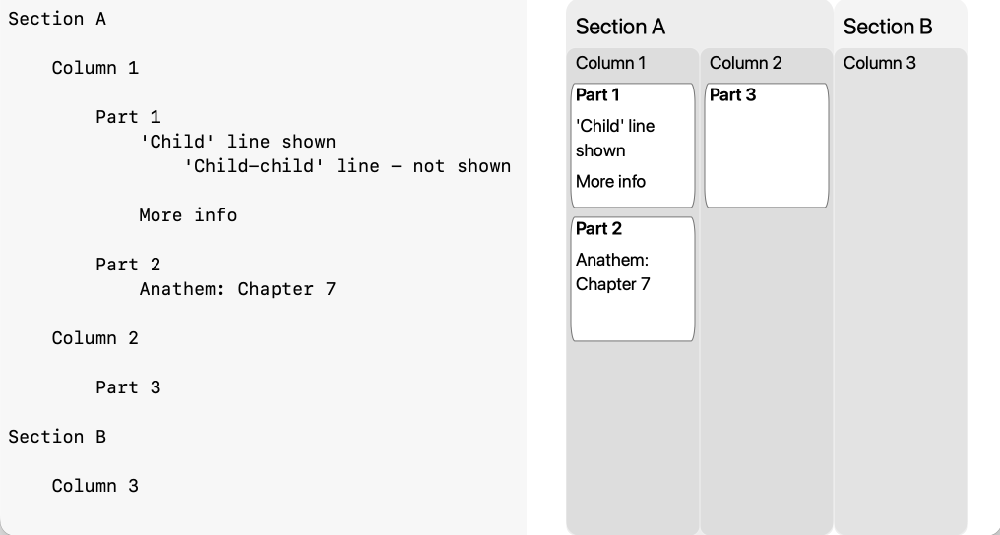
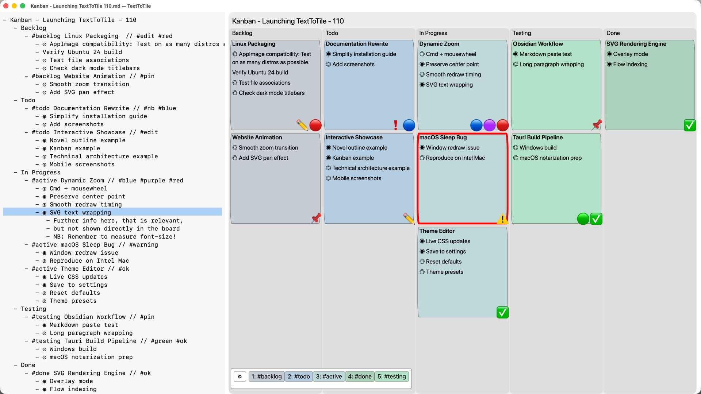
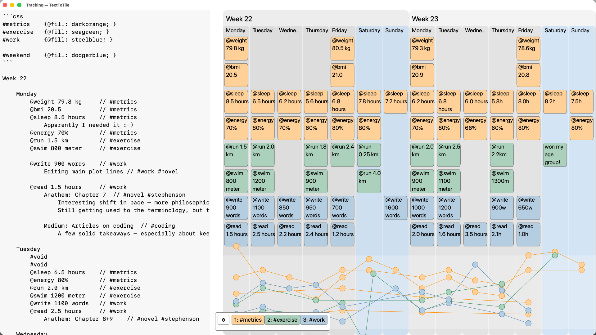

# TextToTile

**See the structure in your text.**

TextToTile is a desktop app that turns structured plain-text outlines into live visual overviews. It is designed for writing, planning, research, tracking, and any other work where seeing the whole structure makes the details easier to understand.

[Website](https://aowagner.github.io/texttotile/) · [Documentation](https://aowagner.github.io/texttotile/docs/concept/) · [Download the beta](https://aowagner.github.io/texttotile/docs/download/) · [Discussions](https://github.com/aowagner/texttotile/discussions)

## How it works

Write or open an ordinary text or Markdown file, then see its hierarchy displayed as sections, columns, and parts. The chart updates as the text changes, whether you edit it in TextToTile's built-in editor or in another application such as Obsidian or VS Code.

Each document can use one of two parse modes:

- **Outline** uses tab indentation, with optional Markdown list markers.
- **Markdown headings** uses heading levels to define the chart structure.

Clicking an item in the chart jumps to the corresponding line in the text, making it easy to move between a broad overview and the underlying detail.

## More than an outline viewer

Tags can group related parts and control colors, icons, borders, and other styling. The same text can be viewed by its original structure or rearranged into tag groups, revealing themes and relationships across the document.

Numeric metadata can also be written directly into the text and visualized as graphs. This makes it possible to track progress, measurements, pacing, or any values that belong alongside the structure they describe.

Possible uses include novel and article planning, project overviews, Kanban-style boards, research maps, journals, personal tracking, travel planning, and workflows of your own design.

## Your text remains yours

TextToTile works directly with local plain-text files. There are no accounts, mandatory cloud services, hidden databases, or network calls. Your information stays readable in other tools, and TextToTile can serve simply as a dedicated visual overview beside your preferred editor.

## Public beta

TextToTile is currently available as a public beta for macOS, Windows, and Linux. The builds are not yet code-signed or notarized, so the operating system may ask you to confirm the installation manually.

See the [Download page](https://aowagner.github.io/texttotile/docs/download/) for current packages and installation instructions.

## Discussions and feedback

Questions, ideas, bug reports, workflow examples, and installation experiences are very welcome. [GitHub Discussions](https://github.com/aowagner/texttotile/discussions) is the main place to share them.

## Support

If TextToTile is useful to you, you can support its continued development.

